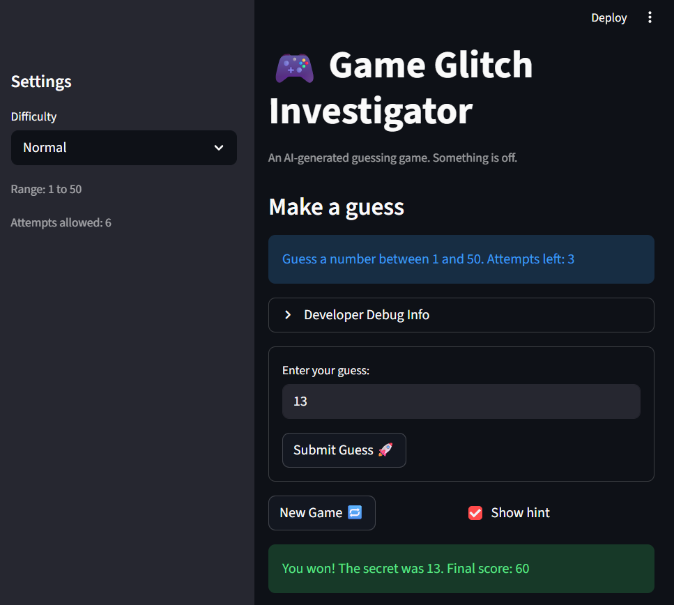

# 🎮 Game Glitch Investigator: The Impossible Guesser

## 🚨 The Situation

You asked an AI to build a simple "Number Guessing Game" using Streamlit.
It wrote the code, ran away, and now the game is unplayable. 

- You can't win.
- The hints lie to you.
- The secret number seems to have commitment issues.

## 🛠️ Setup

1. Install dependencies: `pip install -r requirements.txt`
2. Run the broken app: `python -m streamlit run app.py`

## 🕵️‍♂️ Your Mission

1. **Play the game.** Open the "Developer Debug Info" tab in the app to see the secret number. Try to win.
2. **Find the State Bug.** Why does the secret number change every time you click "Submit"? Ask ChatGPT: *"How do I keep a variable from resetting in Streamlit when I click a button?"*
3. **Fix the Logic.** The hints ("Higher/Lower") are wrong. Fix them.
4. **Refactor & Test.** - Move the logic into `logic_utils.py`.
   - Run `pytest` in your terminal.
   - Keep fixing until all tests pass!

## 📝 Document Your Experience
When starting up the code, I was scared at first by how complex the code structure was. I did not understand a single function at the start. Now when I'm reviewing the game, I learned of it's purpose. It's a guessing game where the user will try to guess the secret number with limited attempts. When looking for bugs, I found out that the Hints were reversed. There was also a problem regarding the registration of the attemps. Even the secret number not being able to stay within the range. Furthremore, there were a lot problem with the submitting guess inputs. Sometimes if the user keep submitting the answer, the score keeps decreasing again and again, the attempts were not decreasing, the hints keep flipping and such. So to fix that, I used Claude to fix the range value for each of the difficulty. It also fixed the input errors. The Hint error by reversing the statements. And lastly it fixed the Score Values.
- [x] Describe the game's purpose.
- [x] Detail which bugs you found.
- [x] Explain what fixes you applied.

## 📸 Demo

- [x] [Insert a screenshot of your fixed, winning game here]

## 🚀 Stretch Features

- [ ] [If you choose to complete Challenge 4, insert a screenshot of your Enhanced Game UI here]
